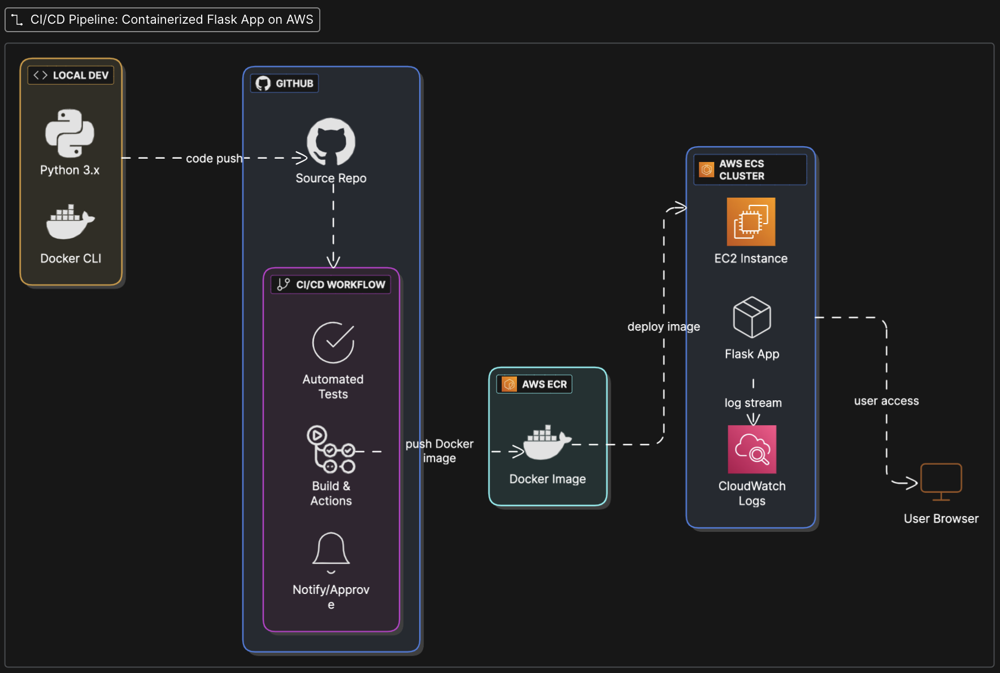

# CI/CD Pipeline for a Containerized Flask Web Application on AWS

This project demonstrates an end-to-end CI/CD pipeline that builds, tests, containerizes, and deploys a Flask web application to AWS ECS using EC2 instances. It includes AWS ECR for image storage, CodePipeline and GitHub Actions for CI/CD, and CloudWatch for monitoring.

---

## 🌐 Overview

The application is a simple Python Flask app that responds with a welcome message and includes a `/stress` endpoint for triggering CPU load (for CloudWatch alarm testing).

---

## 🧱 Project Structure

```
.
├── my_flask_app
│   ├── __init__.py
│   └── app.py
├── tests
│   └── test_app.py
├── Dockerfile
├── requirements.txt
├── .github
│   └── workflows
│       └── ci-cd.yml
```

---

## ⚙️ CI/CD Pipeline

### ✅ CI/CD Steps:

1. **GitHub Push** → triggers GitHub Actions.
2. **GitHub Actions**:
   - Installs dependencies & runs tests.
   - Builds & pushes Docker image to AWS ECR.
   - Triggers a new deployment in AWS ECS.
3. **AWS ECS (EC2)**:
   - Pulls the new Docker image.
   - Spins up the updated container.

---

## 🚀 Live Testing & Monitoring

- Accessible at: `http://<EC2_PUBLIC_IP>:5000`
- CloudWatch Alarm triggers if CPU > 70% (triggered via `/stress` endpoint).

---

## 📦 Docker

Sample Dockerfile:

```dockerfile
FROM python:3.12.3-slim
WORKDIR /app
COPY requirements.txt .
RUN pip install --no-cache-dir -r requirements.txt
COPY my_flask_app /app/my_flask_app
ENV FLASK_APP=my_flask_app.app
CMD ["flask", "run", "--host=0.0.0.0", "--port=5000"]
```

---

## 🧪 Testing

Using `pytest`, a test file is included to ensure the root route returns a 200 status.

---

## 📡 Monitoring

- **Amazon CloudWatch** used to monitor CPU usage.
- **Alarm** sends notification when CPU > 70% for 5 minutes.

---

## 🔐 Secrets and Environment

GitHub secrets used:
- `AWS_ACCESS_KEY_ID`
- `AWS_SECRET_ACCESS_KEY`

Make sure you **do not commit these** to source control.

---

## 📁 Requirements

- Python 3.12
- Flask
- Boto3
- pytest

Install with:

```bash
pip install -r requirements.txt
```

---

## 📝 Author

Jorge Allende  
[GitHub Profile](https://github.com/jorge-allende)

---

## 📌 Notes

- To save AWS credits, stop the EC2 instance when not in use.
- The `README.md` and architecture diagram are part of the GitHub repo for recruiters and hiring managers.

---

## 🖼️ Architecture Diagram


